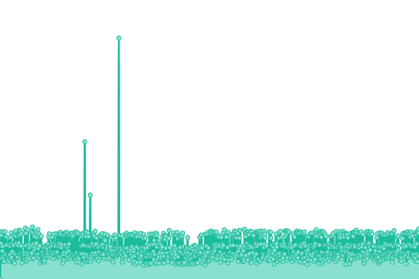
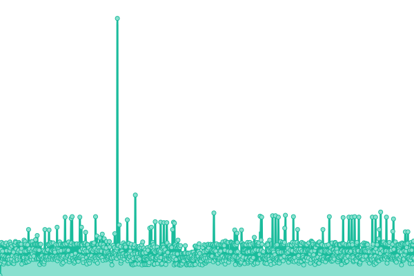
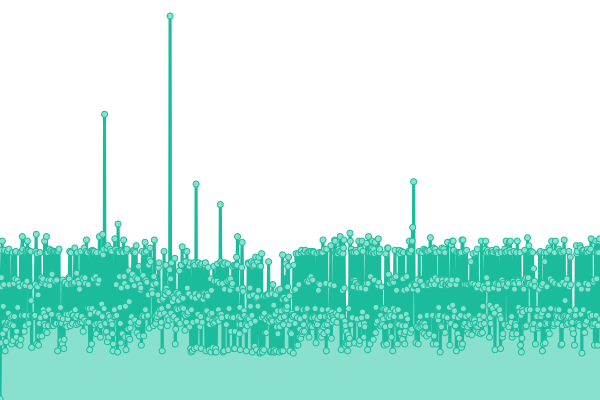
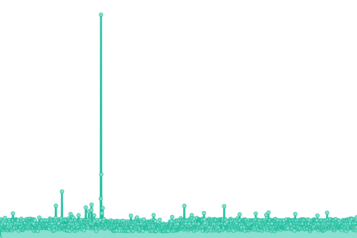

# [📈 Live Status](https://pixmath.github.io/upptime): <!--live status--> **🟩 All systems operational**

This repository contains the open-source uptime monitor and status page for [pixmath](https://pixmath.github.io/upptime), powered by [Upptime](https://github.com/upptime/upptime).

With [Upptime](https://upptime.js.org), you can get your own unlimited and free uptime monitor and status page, powered entirely by a GitHub repository. We use [Issues](https://github.com/pixmath/upptime/issues) as incident reports, [Actions](https://github.com/pixmath/upptime/actions) as uptime monitors, and [Pages](https://pixmath.github.io/upptime) for the status page.

<!--start: status pages-->
<!-- This summary is generated by Upptime (https://github.com/upptime/upptime) -->
<!-- Do not edit this manually, your changes will be overwritten -->
<!-- prettier-ignore -->
| URL | Status | History | Response Time | Uptime |
| --- | ------ | ------- | ------------- | ------ |
|  [TSL Home](https://theskylive.com) | 🟩 Up | [tsl-home.yml](https://github.com/pixmath/upptime/commits/HEAD/history/tsl-home.yml) | 

 339ms
     
 | 

<a href="https://pixmath.github.io/upptime/history/tsl-home">100.00%</a>
    

|  [TSL Info](https://theskylive.com/jupiter-info) | 🟩 Up | [tsl-info.yml](https://github.com/pixmath/upptime/commits/HEAD/history/tsl-info.yml) | 

 120ms
     
 | 

<a href="https://pixmath.github.io/upptime/history/tsl-info">100.00%</a>
    

|  [TSL Planetarium](https://theskylive.com/planetarium?obj=jupiter) | 🟩 Up | [tsl-planetarium.yml](https://github.com/pixmath/upptime/commits/HEAD/history/tsl-planetarium.yml) | 

 56ms
     
 | 

<a href="https://pixmath.github.io/upptime/history/tsl-planetarium">100.00%</a>
    

|  [TSL Comets](https://theskylive.com/comets) | 🟩 Up | [tsl-comets.yml](https://github.com/pixmath/upptime/commits/HEAD/history/tsl-comets.yml) | 

 94ms
     
 | 

<a href="https://pixmath.github.io/upptime/history/tsl-comets">100.00%</a>
    

|  [TSL Guide](https://theskylive.com/guide) | 🟩 Up | [tsl-guide.yml](https://github.com/pixmath/upptime/commits/HEAD/history/tsl-guide.yml) | 

 114ms
     
 | 

<a href="https://pixmath.github.io/upptime/history/tsl-guide">100.00%</a>
    

<!--end: status pages-->

[**Visit our status website →**](https://pixmath.github.io/upptime)

## 📄 License

- Powered by: [Upptime](https://github.com/upptime/upptime)
- Code: [MIT](./LICENSE) © [pixmath](https://pixmath.github.io/upptime)
- Data in the `./history` directory: [Open Database License](https://opendatacommons.org/licenses/odbl/1-0/)
